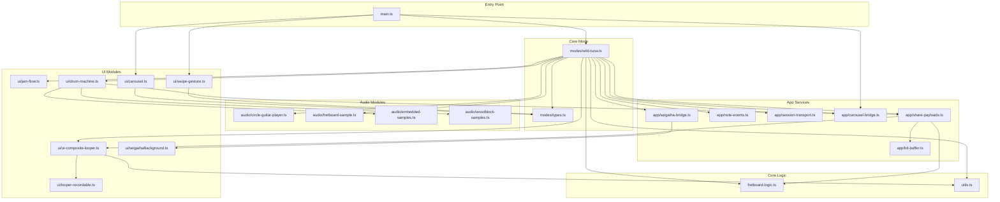

# Wild Tuna Mode — Module Dependency Diagram

## Module Roles

| Module | Role |
|--------|------|
| `modes/wild-tuna.ts` | **Core orchestrator** — wires all subsystems together |
| `ui/jam-flow.ts` | Canvas UI: Circle of Fifths, Key Zoom, and Fretboard views |
| `ui/drum-machine.ts` | Drum transport UI, timing, BPM control |
| `ui/ui-composite-looper.ts` | Reusable looper widget (used for circle & fretboard loopers) |
| `audio/circle-guitar-player.ts` | Chord playback (acoustic, electric, organ instruments) |
| `audio/fretboard-sample.ts` | Fretboard instrument sample loading |
| `app/note-events.ts` | Central event bus aggregating note on/off across loopers |
| `app/session-transport.ts` | Shared playback transport (beat boundaries, measures) |
| `app/share-payloads.ts` | Encode/decode track state for URL sharing |
| `app/carousel-bridge.ts` | Decoupled bridge to hide/show carousel (fullscreen support) |
| `app/seigaiha-bridge.ts` | Controls background animation (randomness, detune) |
| `fretboard-logic.ts` | Fretboard state: root, scale, chord, dot positions |
| `utils.ts` | `clamp()`, `getOrCreateAudioContext()` |
| `main.ts` | App entry point — registers Wild Tuna, handles fullscreen |
